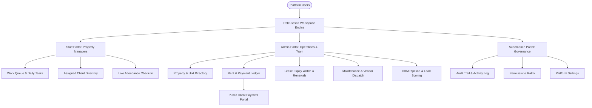

# Estate Nexus (Adire Estates)
### Enterprise Real Estate Operations & Portfolio Operating System

> **Estate Nexus** is an enterprise-ready, multi-tenant real estate management platform built specifically for modern property companies, estate managers, and real estate operational teams in Nigeria.

---

## 🌟 Executive Platform Showcase

Estate Nexus unifies property portfolio oversight, leasing lifecycles, tenant communications, vendor maintenance, and business intelligence into a cohesive, high-density operational workspace.

---

## 🚀 Key Functional Modules

### 1. Multi-Role Operating System
* **Staff Workspace (Property Managers)**: Dedicated daily checklist, personal client roster, payment recording wizard, and attendance check-in module.
* **Operations Admin**: Executive dashboard with revenue analytics, property performance progress bars, workload distribution metrics, and department oversight.
* **Superadmin Governance**: System-wide activity logs, role capability matrices, and organization config controls.

### 2. Financial Management & Payment Ledger
* **Naira Revenue Tracking**: Real-time aggregation of expected rent, collected payments, outstanding balances, and collection rates (%).
* **Categorized Ledger**: Itemized tracking across Rent, Service Charge, Security Deposit, and Agency fees with unique reference codes (`PAY-XXXX`) and printable receipts (`RCP-XXXX`).
* **Accounts Confirmation Workflow**: Verification pipeline for incoming payments before ledger finalization.

### 3. Public Read-Only Client Payment Portal
* **Secure Token Access**: Dedicated link (`/client-portal/$token`) enabling clients to view their payment history, next payment dues, and account timeline without needing password authentication.
* **Live Completion Metrics**: Visual progress indicator showing payment completion percentages for the current lease cycle.
* **Management Controls**: One-click token regeneration, instant link disabling, and link expiry configuration.

### 4. Property & Unit Inventory
* **Asset Portfolio**: Detailed property profiles (e.g., Riverside Court Ikoyi, Aba Road Mews Lekki, Wuse 2 Residences Abuja) displaying unit capacity, occupancy percentages, and property manager assignments.
* **Unit Status Pipeline**: Dynamic unit state transitions (`Available`, `Occupied`, `Reserved`, `Under Maintenance`, `Overdue`).

### 5. Lease Lifecycle & Renewal Watch
* **Expiry Radar**: Automated countdown tracking leases due for renewal within 90 days.
* **Renewal Engine**: One-click contract extension with rent adjustment tracking and audit logging.
* **Move-Out Processing**: Automated unit release and tenant offboarding workflow.

### 6. Maintenance & Vendor Operations
* **Priority Triage**: Repair request classification (`High`, `Medium`, `Low`) with estimated cost tracking (₦).
* **Vendor Assignment**: Dispatch system for facility management technicians and specialized contractors.

### 7. Real Estate CRM & Lead Scoring
* **Kanban Pipeline**: Prospect progression across stages (`New Lead` → `Contacted` → `Qualified` → `Viewing` → `Negotiation` → `Documentation` → `Closed`).
* **Lead Scoring**: Quantitative prospect scoring based on budget, property interest, and contact recency.

### 8. Portfolio Intelligence Engine
* **Automated Alert Rules**: Dynamic notifications flagging overdue payments, expiring leases, uncontacted prospects, and revenue increases.

### 9. Attendance & Governance Audit Log
* **Daily Attendance**: Web and mobile check-in logging with latency tracking, duration calculation, and monthly attendance percentage rates.
* **Audit Log**: Timestamped, non-repudiable log of all actions taken across the platform.

---

## 🔒 Security & Privacy Notice

This repository serves as a **Public Product Showcase & Documentation Hub** detailing the architecture, features, and capabilities of Estate Nexus. 

* **No private credentials**, API keys, or environment configuration files are contained in this repository.
* **No proprietary source code** is exposed in this public showcase.

---

*Designed & Built for Premium Real Estate Operations.*